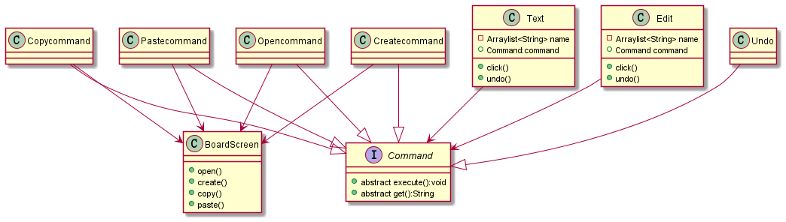
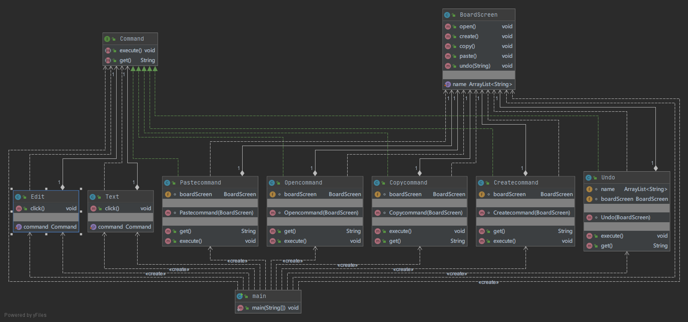
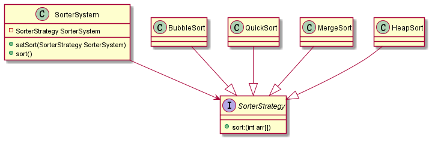
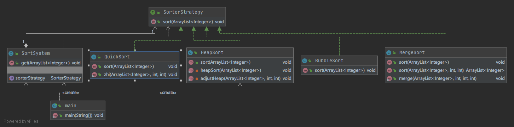
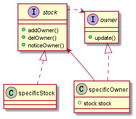
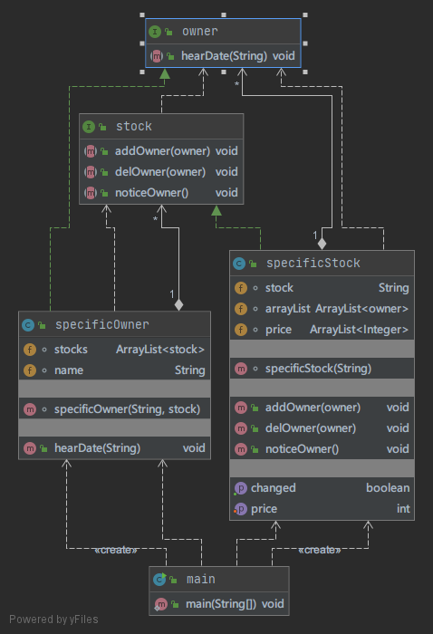
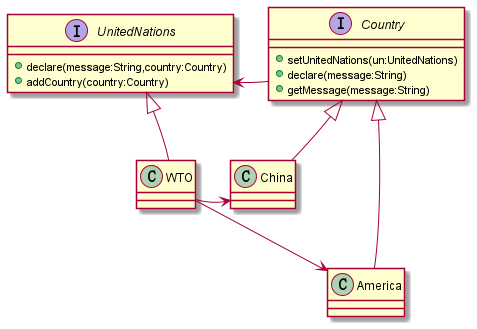
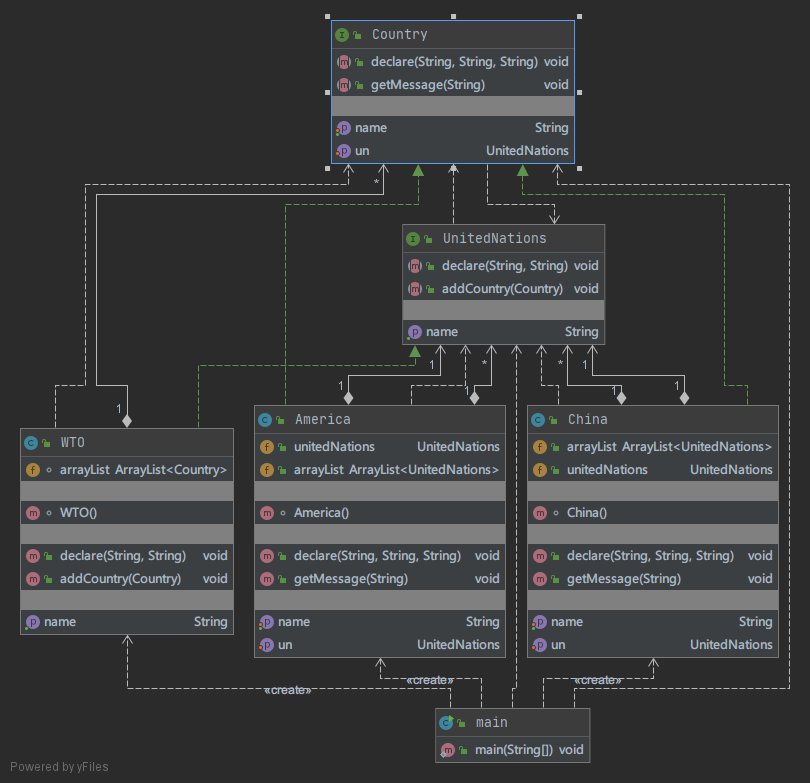

# software_Design_Pattern_Experiment
软件设计模式实验_java

[toc]

### 声明：所有的操作都是简单的一句话，是用来练习软件设计模式的。

-------

### 一、命令模式

#### 1.题目

使用命令模式设计一简单文本编辑器的界面。要求提供一个主菜单，主菜单中包含“文件”和“编辑”两个菜单项，菜单项的主要方法是click（），每个菜单项包含一个抽象命令类，具体命令类包括OpenCommand(打开命令)，CreateCommand(新建命令)，CopyCommand(拷贝命令)，PasteCommand（粘贴命令）等，命令类具有一个execute()方法，用于调用界面类(BoardScreen)的open()、create()、copy()、paste()等方法,这些方法的具体内容可以是简单的“System.out.println("xxx方法被调用");”。选做内容：增加日志功能（将所有操作记录到一个文件中）和撤销操作（Undo）

 

#### 2.分析

- 命令模式包含四种角色：命令接口、具体命令、请求者、接收者

- 根据命令模式的四种角色分析认为：
  - 命令接口：Command
  - 具体命令：Copycommand、OpenCommand、CreateCommand、PasteCommand、Undo
  - 请求者：Text、Edit
  - 接收者：BoardScreen
  
- 根据分析画出初步的Uml图：

  

  

#### 3.实现

  - 命令接口：
  
    - Command:接口类，有一个抽象执行类execute()，和一个得到执行名称的类get()
  - 具体命令：
    - Copycommand：实现类，声明一个BoardScreen，调用其copy方法，返回copy名称。
    - OpenCommand：实现类，声明一个BoardScreen，调用其open方法，返回open名称。
    - CreateCommand：实现类，声明一个BoardScreen，调用其create方法，返回create名称。
    - PasteCommand：实现类，声明一个BoardScreen，调用其paste方法，返回paste名称。
    - Undo:实现类，撤销操作。声明一个BoardScreen，声明一个Arraylist用来操作接收者中的列表，执行的时候判断列表有没有值，如果有则调用undo方法，然后移除列表最后一项，然后更新接收者中的列表。返回空名称
  
  - 请求者：
    - Text:声明一个command，一个设置command的方法，一个点击执行的方法
    - Edit:声明一个command，一个设置command的方法，一个点击执行的方法
  
  - 接收者：
    - BoardScreen：接收者类，声明一个Arraylist用来存放操作步骤。所有的操作都是一句话然后将操作名称存入Arraylist中。

#### 4.体会

 将实际操作者和请求者分开，相当于给操作进行了封装，请求者不需要知道所有的操作方法和如何实现，只需要声明一个命令接口然后实例化一个封装好的具体命令就可以了。

#### 5.最终类图

------

### 二、策略模式

#### 声明：这里的排序是有实际代码

#### 1.题目

用策略模式设计一个排序系统（Sorter System），客户端可以动态地决定采用冒泡排序（Bubble Sort）、快速排序（Quick Sort）、归并排序（Merge Sort)、堆排序（Heap Sort）。

#### 2.分析

- 策略模式具有三个角色：策略、具体策略、上下文

- 根据题目：

  - 策略：SorterStrategy
  - 具体策略：BubbleSort、QuickSort、MergeSort、HeapSort
  - 上下文：SorterSystem

- 根据分析画出类图：

  - 

   

#### 3.实现

- SorterStrategy:接口类，只有一个sort()排序方法

- 具体策略:

  - BubbleSort:  <a href="https://blog.csdn.net/qq_41679818/article/details/90296399">冒泡引用</a>
  - QuickSort:  <a href="https://www.cnblogs.com/captainad/p/10999697.html">快排引用</a>
  - MergeSort: <a href="https://www.cnblogs.com/of-fanruice/p/7678801.html">归并引用</a>
  - HeapSort：<a href="https://www.cnblogs.com/luomeng/p/10618709.html">堆排序引用</a>
  
- 上下文：具有一个接口类，一个设定具体策略的方法，一个得到排序结果的方法。

#### 4.体会

 策略模式，将实现和使用解耦，后期增删都很方便，但是需要用户知道所有的策略。感觉和命令模式很相像。

 与命令模式做对比：

- 相同点
  - 都是封装，用户不需要知道具体的实现细节。
  - 调用接口，进行解耦
- 不同点
  - 针对不同目标：命令模式解决不同问题，策略模式解决一个问题的不同方法
  - 命令模式有一个执行者，如果将接收者和具体命令进行结合个人感觉和策略模式的实现方式一样。

#### 5.最终类图

-------

### 三、观察者模式

#### 1.题目

 某在线股票软件需要提供如下功能：当股票购买者所购买的某支股票价格变化幅度达到5%时，系统将自动发送通知（包括新价格）给购买该股票的股民。现使用观察者模式设计该系统，绘制类图并编程模拟实现（要求定义抽象层）

#### 2.分析

- 观察者模式具有四个角色：主题、具体主题、观察者、具体观察者
- 根据题目：股票是抽象类主题，股民是抽象类观察者。有具体的观者者和股票，这里没要求写出拉数据操作，目前不实现拉数据

- 根据分析画出类图：

  

#### 3.实现

- owner:拥有者接口，只有一个监听方法
- stock:股票接口，拥有添加、删除、通知三个方法
- specificOwner：拥有者具体类，具有一个Arraylist用来存放股票类，一个收消息方法
- specificStock: 股票具体类，具有一个Arraylist存放拥有者，一个Arraylist存放价格。

#### 4.体会

 这个观察者类，比较形象，是多个对象对一个对象数据的变化，股票和拥有者是很形象的例子。股票有很多种，拥有者有很多个，不同拥有者可以拥有不同股票，每一个股票变化波动超过某一幅度通知其拥有者。推数据实现了，拉数据应该是拥有者自主去获取某一个或者所有股票的变化，目前题目没有要求实现拉数据，之后维护可以考虑添加。

####  5.最终类图

 

------

### 四、中介者模式

#### 1.题目

使用中介者模式来说明联合国的作用。注：可以将联合国定义为抽象中介者类，联合国下属机构如WTO、WHO等作为具体中介者类，国家作为抽象同事类，将中国、美国等国家作为具体同事类。

#### 2.分析

- 中介者模式具有四个角色：中介者、具体中介者、同事、具体同事
- 题目规定：
  - 中介者：联合国
  - 具体中介者：WTO
  - 同事：国家
  - 具体同事：中国、美国

- 根据分析设计类图
  - 

#### 3.实现

- UnitedNations:抽象中介者，拥有一个添加国家方法和表述方法
- Country:抽象同事类，有设定和得到名称，有设定中介者方法，有从传递方法，有得到消息方法
- WTO：具体中介者类，有一个Arraylist保存国家，实现传递信息方法，实现添加国家方法
- America：具体同事类
- China:具体同事类

#### 4.体会

 中介者类是针对很多对象之间的交互，将复杂的关系图变成了星型结构，这样构图清晰方便使用调用。个人感觉这个抽象同事接口和抽象中介者接口都应该改为抽象类，或者在这中间添加抽象类，很多方法都是相同的。

#### 5.最终类图

