- [ software_Design_Pattern_Experiment](#head1)
	- [ 声明：所有的操作都是简单的一句话，是用来练习软件设计模式的。](#head2)
	- [ 一、命令模式](#head3)
		- [ 1.题目](#head4)
		- [ 2.分析](#head5)
		- [ 3.实现](#head6)
		- [ 4.体会](#head7)
		- [ 5.最终类图](#head8)
	- [ 二、策略模式](#head9)
		- [ 声明：这里的排序是有实际代码](#head10)
		- [ 1.题目](#head11)
		- [ 2.分析](#head12)
		- [ 3.实现](#head13)
		- [ 4.体会](#head14)
		- [ 5.最终类图](#head15)
	- [ 三、观察者模式](#head16)
		- [ 1.题目](#head17)
		- [ 2.分析](#head18)
		- [ 3.实现](#head19)
		- [ 4.体会](#head20)
		- [ 5.最终类图](#head21)
	- [ 四、中介者模式](#head22)
		- [ 1.题目](#head23)
		- [ 2.分析](#head24)
		- [ 3.实现](#head25)
		- [ 4.体会](#head26)
		- [ 5.最终类图](#head27)
	- [ 五、适配器模式](#head28)
		- [ 1.题目](#head29)
		- [ 2.分析](#head30)
		- [ 3.实现](#head31)
		- [ 4.体会](#head32)
		- [ 5.最终类图](#head33)
	- [ 六、工厂模式](#head34)
		- [ 1.题目](#head35)
		- [ 2.分析](#head36)
		- [ 3.实现](#head37)
		- [ 4.体会](#head38)
		- [ 5.最终类图](#head39)
	- [ 七、综合1](#head40)
		- [ 1.题目](#head41)
		- [ 2.分析](#head42)
		- [ 3.实现](#head43)
		- [ 4.体会](#head44)
		- [ 5.最终类图](#head45)
	- [ 八、综合2](#head46)
		- [ 1.题目](#head47)
		- [ 2.分析](#head48)
		- [ 3.实现](#head49)
		- [ 4.体会](#head50)
		- [ 5.最终类图](#head51)
#  software_Design_Pattern_Experiment
软件设计模式实验_java

[toc]

###  声明：所有的操作都是简单的一句话，是用来练习软件设计模式的。

-------

###  一、命令模式

####  1.题目

使用命令模式设计一简单文本编辑器的界面。要求提供一个主菜单，主菜单中包含“文件”和“编辑”两个菜单项，菜单项的主要方法是click（），每个菜单项包含一个抽象命令类，具体命令类包括OpenCommand(打开命令)，CreateCommand(新建命令)，CopyCommand(拷贝命令)，PasteCommand（粘贴命令）等，命令类具有一个execute()方法，用于调用界面类(BoardScreen)的open()、create()、copy()、paste()等方法,这些方法的具体内容可以是简单的“System.out.println("xxx方法被调用");”。选做内容：增加日志功能（将所有操作记录到一个文件中）和撤销操作（Undo）

####  2.分析

- 命令模式包含四种角色：命令接口、具体命令、请求者、接收者

- 根据命令模式的四种角色分析认为：
- 命令接口：Command
- 具体命令：Copycommand、OpenCommand、CreateCommand、PasteCommand、Undo
- 请求者：Text、Edit
- 接收者：BoardScreen

- 根据分析画出初步的Uml图：

####  3.实现

- 命令接口：

- Command:接口类，有一个抽象执行类execute()，和一个得到执行名称的类get()
- 具体命令：
- Copycommand：实现类，声明一个BoardScreen，调用其copy方法，返回copy名称。
- OpenCommand：实现类，声明一个BoardScreen，调用其open方法，返回open名称。
- CreateCommand：实现类，声明一个BoardScreen，调用其create方法，返回create名称。
- PasteCommand：实现类，声明一个BoardScreen，调用其paste方法，返回paste名称。
- Undo:实现类，撤销操作。声明一个BoardScreen，声明一个Arraylist用来操作接收者中的列表，执行的时候判断列表有没有值，如果有则调用undo方法，然后移除列表最后一项，然后更新接收者中的列表。返回空名称

- 请求者：
- Text:声明一个command，一个设置command的方法，一个点击执行的方法
- Edit:声明一个command，一个设置command的方法，一个点击执行的方法

- 接收者：
- BoardScreen：接收者类，声明一个Arraylist用来存放操作步骤。所有的操作都是一句话然后将操作名称存入Arraylist中。

####  4.体会

将实际操作者和请求者分开，相当于给操作进行了封装，请求者不需要知道所有的操作方法和如何实现，只需要声明一个命令接口然后实例化一个封装好的具体命令就可以了。

####  5.最终类图

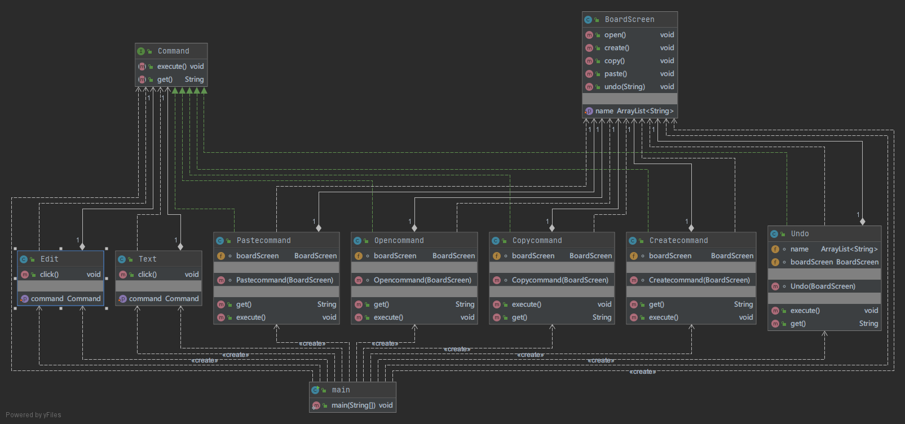

------

###  二、策略模式

####  声明：这里的排序是有实际代码

####  1.题目

用策略模式设计一个排序系统（Sorter System），客户端可以动态地决定采用冒泡排序（Bubble Sort）、快速排序（Quick Sort）、归并排序（Merge Sort)、堆排序（Heap Sort）。

####  2.分析

- 策略模式具有三个角色：策略、具体策略、上下文

- 根据题目：

- 策略：SorterStrategy
- 具体策略：BubbleSort、QuickSort、MergeSort、HeapSort
- 上下文：SorterSystem

- 根据分析画出类图：

- 

####  3.实现

- SorterStrategy:接口类，只有一个sort()排序方法

- 具体策略:

- BubbleSort:  <a href="https://blog.csdn.net/qq_41679818/article/details/90296399">冒泡引用</a>
- QuickSort:  <a href="https://www.cnblogs.com/captainad/p/10999697.html">快排引用</a>
- MergeSort: <a href="https://www.cnblogs.com/of-fanruice/p/7678801.html">归并引用</a>
- HeapSort：<a href="https://www.cnblogs.com/luomeng/p/10618709.html">堆排序引用</a>

- 上下文：具有一个接口类，一个设定具体策略的方法，一个得到排序结果的方法。

####  4.体会

策略模式，将实现和使用解耦，后期增删都很方便，但是需要用户知道所有的策略。感觉和命令模式很相像。

与命令模式做对比：

- 相同点
- 都是封装，用户不需要知道具体的实现细节。
- 调用接口，进行解耦
- 不同点
- 针对不同目标：命令模式解决不同问题，策略模式解决一个问题的不同方法
- 命令模式有一个执行者，如果将接收者和具体命令进行结合个人感觉和策略模式的实现方式一样。

####  5.最终类图

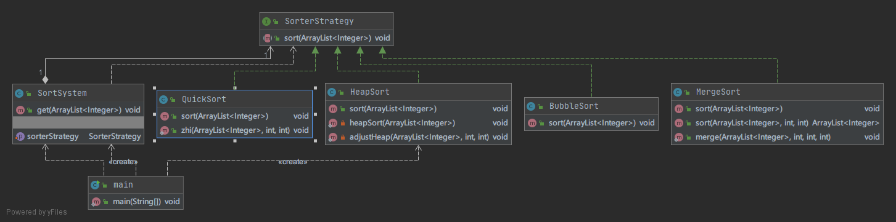

-------

###  三、观察者模式

####  1.题目

某在线股票软件需要提供如下功能：当股票购买者所购买的某支股票价格变化幅度达到5%时，系统将自动发送通知（包括新价格）给购买该股票的股民。现使用观察者模式设计该系统，绘制类图并编程模拟实现（要求定义抽象层）

####  2.分析

- 观察者模式具有四个角色：主题、具体主题、观察者、具体观察者
- 根据题目：股票是抽象类主题，股民是抽象类观察者。有具体的观者者和股票，这里没要求写出拉数据操作，目前不实现拉数据

- 根据分析画出类图：

####  3.实现

- owner:拥有者接口，只有一个监听方法
- stock:股票接口，拥有添加、删除、通知三个方法
- specificOwner：拥有者具体类，具有一个Arraylist用来存放股票类，一个收消息方法
- specificStock: 股票具体类，具有一个Arraylist存放拥有者，一个Arraylist存放价格。

####  4.体会

这个观察者类，比较形象，是多个对象对一个对象数据的变化，股票和拥有者是很形象的例子。股票有很多种，拥有者有很多个，不同拥有者可以拥有不同股票，每一个股票变化波动超过某一幅度通知其拥有者。推数据实现了，拉数据应该是拥有者自主去获取某一个或者所有股票的变化，目前题目没有要求实现拉数据，之后维护可以考虑添加。

####  5.最终类图

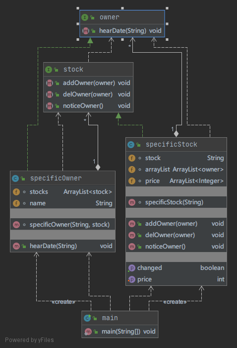

------

###  四、中介者模式

####  1.题目

使用中介者模式来说明联合国的作用。注：可以将联合国定义为抽象中介者类，联合国下属机构如WTO、WHO等作为具体中介者类，国家作为抽象同事类，将中国、美国等国家作为具体同事类。

####  2.分析

- 中介者模式具有四个角色：中介者、具体中介者、同事、具体同事
- 题目规定：
- 中介者：联合国
- 具体中介者：WTO
- 同事：国家
- 具体同事：中国、美国

- 根据分析设计类图
- 

####  3.实现

- UnitedNations:抽象中介者，拥有一个添加国家方法和表述方法
- Country:抽象同事类，有设定和得到名称，有设定中介者方法，有从传递方法，有得到消息方法
- WTO：具体中介者类，有一个Arraylist保存国家，实现传递信息方法，实现添加国家方法
- America：具体同事类
- China:具体同事类

####  4.体会

中介者类是针对很多对象之间的交互，将复杂的关系图变成了星型结构，这样构图清晰方便使用调用。个人感觉这个抽象同事接口和抽象中介者接口都应该改为抽象类，或者在这中间添加抽象类，很多方法都是相同的。

####  5.最终类图

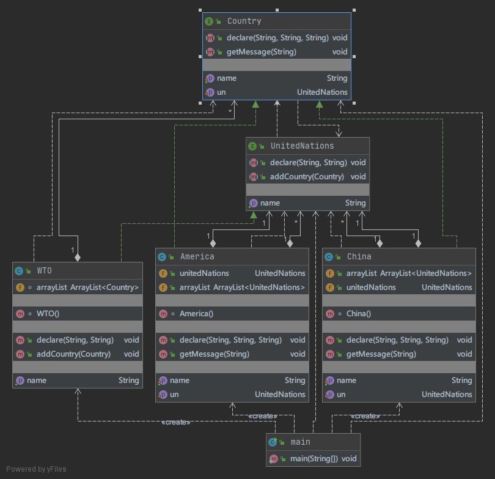

***

###  五、适配器模式

####  1.题目

**1.** 利用适配器模式实现 “指方为圆” 。设计提示见图：

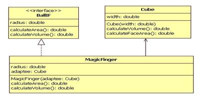

####  2.分析

- 适配器模式具有三个角色：目标、被适配者、适配器
- 目标为Ballif，被适配者为Cube，适配器为MagicFinger

####  3.实现

- Ballif：接口类，默认radius为0，一个计算面积方法，一个计算体积方法
- MagicFinger：适配器，实现接口，这里默认Π为3.14 。两个方法均为球体计算方法
- Cube：目标类，具有一个边长，两个方法为计算立方体方法。

####  4.体会

适配器模式实际上就是对数据进行处理，如果要适配的多了，但是没要求对所有方法进行适配，抽象适配器类来实现接口更加合适。

####  5.最终类图

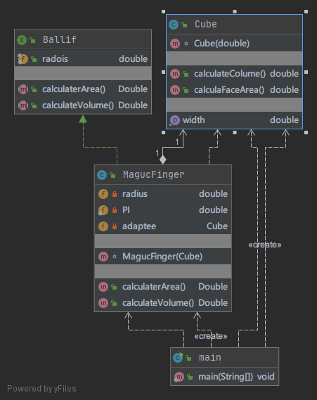

***

###  六、工厂模式

####  1.题目

**1.** 某系统日志记录器要求支持多种日志记录方式，如文件记录、数据库记录等，且用户可以根据要求动态选择日志记录方式，使用工厂方法模式设计该系统。

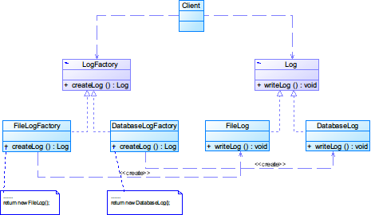

####  2.分析

- 工厂模式包含四个角色：抽象产品、具体产品、构造者、具体构造者
- LogFactory为构造者，Log为抽象产品，FileLogFactory和DatabaseLogFactory为具体构造者，FileLog和DatabaseLog为具体产品。

####  3.实现

- Client：拥有一个抽象产品和设定抽象产品的方法，以及一个写日志的方法
- Log:抽象产品，又有一个写日志的方法
- LogFactory：构造者类，拥有一个创建日志的方法
- DatabaseFactory和FileLogFactory：具体构造者，实现构造类，创建具体的产品
- FileLog和DatabaseLog：具体产品，实现抽线产品接口

####  4.体会

做到这里，感觉设计模式目标都是对方法或者实现进行封装，用来进行解耦操作，使其调用或者修改添加更加的方便。工厂模式也是这样，最后使用的时候声明两个接口然后需要哪一个就对哪一个进行具体的实例化。

####  5.最终类图

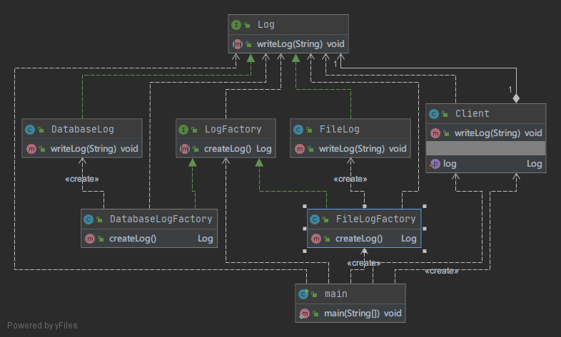

-----

###  七、综合1

####  1.题目

在某系统的报表处理模块中，需要将报表显示和数据采集分开，系统可以有多种报表显示方式也可以有多种数据采集方式，如可以从文本文件中读取数据，也可以从数据库中读取数据，还可以从Excel文件中获取数据。如果需要从Excel文件中获取数据，则需要调用与Excel相关的API，而这个API是现有系统所不具备的，该API由厂商提供。使用适配器模式和桥接模式模拟该模块实现，可

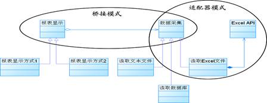

####  2.分析

- 本题是桥接模式和适配器模式的综合应用
- 桥接模式主要针对的是多种组合，也就是报表显示方式和数据采集方式的组合
- 适配器模式主要针对的是调用api获取数据与需要数据不一致的问题
- 桥接模式具有四个角色：
- 抽象：抽象类，在这里应该为报表显示，因为报表显示里应该包含数据采集的方式
- 实现者：接口类，在这里为数据采集
- 细化抽象：在这里为报表不同的显示方法，调用不同的采集方法
- 具体实现者：为三种数据采集方式
- 适配器模式：
- 上面有相应的描述
- 个人认为读取Excel应该是适配器中的目标，ExecelApi为被适配者，中间有一个适配器
- 因为数据采集是一个接口，只负责提供调用不用管具体的实现。ExecelApi只负责提供数据不负责处理数据因此应该是被适配者。读取execle文件因该和其他方法是相同的提供相同格式的数据，这里应该只负责数据的提供而不是处理，如果包含数据处理的话，代码和其他方法就不统一了，后续应用和修改会带来麻烦，所以这个应该是目标，中间有一个适配器用来处理数据。

- 根据分析画出设计类图
- 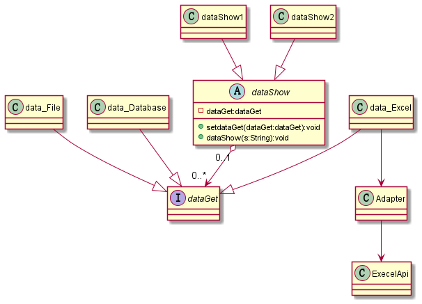

####  3.实现

- dataGet:接口类，桥接模式中的实现者，具有数据获取展示方法
- dataShow：抽象类，桥接模式中的抽象，拥有dataGet方便调用，一个设定数据获取方式的方法，一个展示数据的方法。
- dataShow1、dataShow2：桥接模式中的细化抽象，继承dataShow，细化dataShow方法
- data_Execle、data_File、data_Database:桥接模式中的具体实现者，都有一个展示获取数据的方法，data_Execle额外多了一个适配器和其展示
- Adapter：适配器，转化数据
- ExecleApi：获取数据

####  4.体会

两个模式的简单综合，主要还是对桥接模式进行了解。桥接模式是对两个或多个组合，这样组合，减少了多个的重复的使用，和组合模式很相似，但是组合模式一般是固定的，这个可以自由搭配。核心思想是对重复的进行封装然后方便组合调用

####  5.最终类图

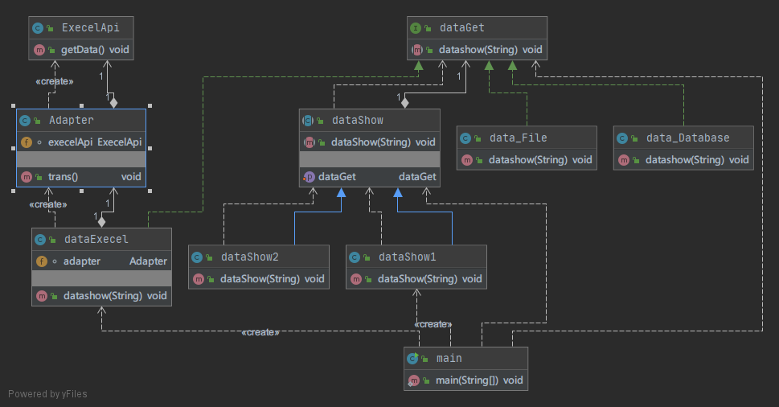

----

###  八、综合2

####  1.题目

现在的很多明星都有经纪人，所有的业务都是通过经纪人进行联络和活动。明星在演戏时会使用替身，替身经过包装后，观众以为是明星本人在演戏。可以采用代理模式、装饰模式或适配器模式来模拟实现

####  2.分析

- 这道题目共有三个角色：经纪人、明星和替身
- 根据题目要求，经纪人与明星之间使用代理模式。明星与替身，经过思考使用装饰模式，因为最终出演的是明星那个状态，可以有多个替身经过打扮装饰最后成为观众眼里的那个明星状态，打扮可以有多种，多层，适配器模式如果写多层适配器显得繁琐。

- 根据分析画出设计类图
- 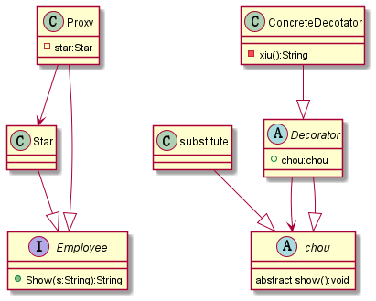

####  3.实现

- Employee:代理模式中的公告接口，只有一个Show方法
- Star：明星，实现Employee接口，如果Show获得的是“活动”则返回“出演”否则返回“以后联系”
- Proxv：经纪人，实现Employee接口，包含一个Star，如果Show获得不是“恐吓”则将电话转接给明星，如果是的话则返回“不接电话”
- chow：装饰模式中的抽象组件，只有一个show()方法。
- Decorator：抽象组件，包含一个接口声明
- ConcreteDectator：具体装饰，一个装饰类，一个show()方法
- subsitute:替身，实现chou

####  4.体会

装饰模式和代理模式的综合应用，代理模式可以看作是一个过滤器，可以自己设定某些内容的返回内容和过滤内容以及自己感兴趣的内容，这个可以和工厂模式、命令模式相结合进行完善。装饰模式是对一个普通内容进行一层一层的装饰，这个和适配器在这一题中都可以使用，但这个是一层一层的不同的装饰，适配器也可以不过适配器更加写死，之后的增删都不方便。

####  5.最终类图

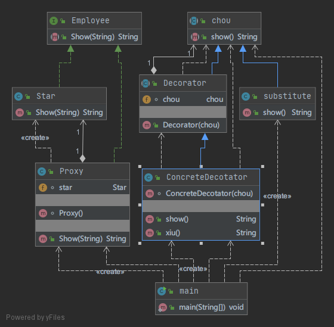

